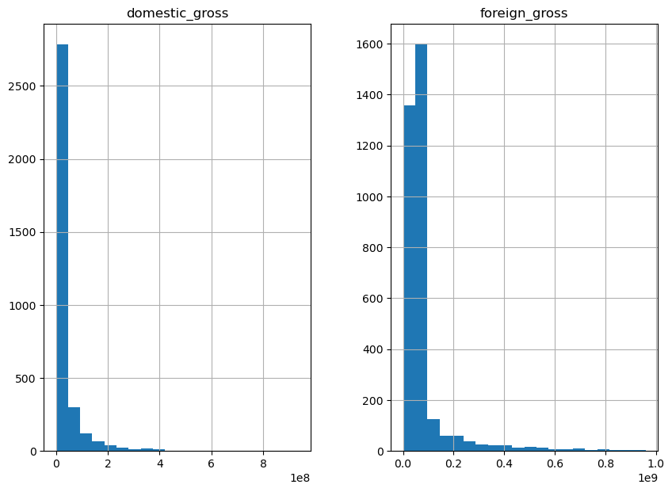

Microsoft Movie Studio EDA

Project Overview

For this project, we conducted exploratory data analysis to generate insights for Microsoft as they venture into the movie industry. By analyzing data from various sources, we aimed to provide valuable recommendations to help Microsoft make informed decisions in their movie production endeavors.

Business Problem

Understanding the dynamics of movie genres is pivotal in the success of a movie production venture. The selection of genres significantly impacts audience engagement, box office performance, and overall profitability. Consequently, identifying the most appealing genres and understanding the preferences of target demographics are critical aspects of strategic decision-making in the entertainment industry. Additionally, recognizing genres to avoid can help mitigate risks and optimize resource allocation for maximum returns on investment.

Data

In our quest to tackle these challenges, we have leveraged comprehensive data sources to inform our analyses and recommendations. The data encompass various dimensions crucial to understanding audience preferences and box office performance. By harnessing information from IMDb, which provides insights into movie ratings, genre classifications, and viewer votes, we gain a deep understanding of audience perceptions and preferences. Furthermore, our analysis incorporates data from Box Office Mojo, offering invaluable insights into domestic and foreign gross earnings, providing a comprehensive picture of a movie's financial performance on a global scale.

Methods

Our methodology revolves around extracting meaningful insights from vast datasets through rigorous analysis techniques. We employ frequency counts and correlation analyses to discern patterns and relationships within the data. By quantifying the prevalence of different movie genres and exploring correlations between domestic and foreign gross earnings, we aim to uncover actionable insights that inform strategic decision-making in movie production.

Results

Our analysis yields compelling results that shed light on key trends and correlations within the movie industry. We observe a robust positive correlation between domestic and foreign gross earnings, indicating the interdependence of these two revenue streams. 
Furthermore, our findings reveal that movies with higher domestic earnings tend to garner proportionally higher foreign earnings, underscoring the importance of domestic market performance in driving overall profitability. 
Additionally, we delve into the relationship between viewer ratings and votes, providing valuable insights into audience perceptions and engagement levels.

Conclusions

In summary, our analysis highlights several key observations that can inform strategic decision-making in movie production. We identify the twenty most common movie genres and offer insights into their performance metrics. Moreover, our findings underscore the significance of domestic market performance, as well as the correlation between viewer ratings and box office success. Armed with these insights, movie studios can make informed decisions regarding genre selection, target audience identification, and resource allocation to optimize their chances of success in the competitive landscape of the entertainment industry.

Recommendations

Based on our analysis, we offer several recommendations to guide the strategic direction of new movie studios entering the market. Firstly, we suggest selecting genres from the identified common genres and those with higher average viewer ratings to maximize audience appeal and engagement. Additionally, we advise studios to prioritize the domestic market while considering the potential for foreign earnings, leveraging the positive correlation between domestic and foreign gross. Furthermore, we recommend avoiding genres with low average ratings and votes, as these may indicate limited audience appeal and potential underperformance at the box office.

Next Steps

Moving forward, we advocate for further analysis to delve deeper into audience preferences and industry trends. This includes identifying specific genres preferred by the domestic market to inform targeted production decisions. Moreover, exploring the influence of movie popularity based on the presence of specific actors in the cast can provide valuable insights into audience preferences and engagement levels. Additionally, continuous monitoring of industry trends and competitor performance is essential to stay abreast of evolving audience preferences and genre popularity, allowing studios to adapt their strategies accordingly for sustained success in the dynamic landscape of the entertainment industry.

Thank You

This comprehensive presentation has been prepared by Jacinta Chepkemoi, leveraging data-driven insights to inform strategic decision-making in movie production. For any further inquiries or collaborations, please feel free to reach out on LinkedIn. I look forward to the opportunity to collaborate and drive innovation in the entertainment industry.
www.linkedin.com/in/jacinta-chepkemoi-9936b0220

